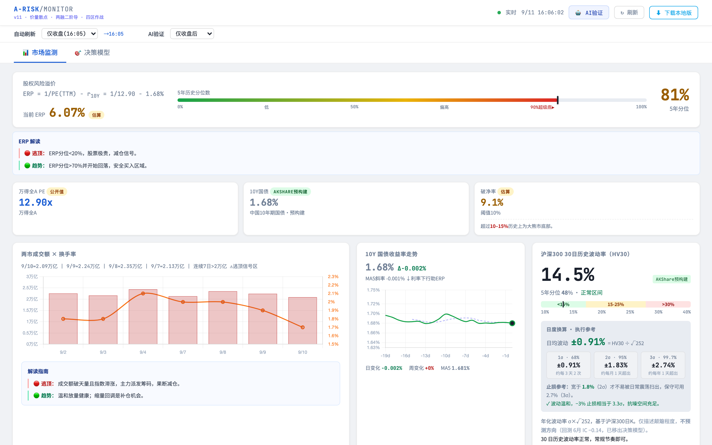

# A股风险监视器 · A-RISK/MONITOR

一个本地运行的 A 股大盘风险监测看板：ERP 股权风险溢价、万得全A PE、10Y 国债、破净率、两市成交额×换手率、HV30 波动率、信贷脉冲（社融存量同比一阶导）、两融余额+动量、ETF 资金流向、申万行业热力图，以及一个「两层漏斗决策模型」给出综合仓位建议。

行情数据走 **moomoo OpenAPI**（本机 moomoo OpenD 网关）；宏观数据（社融、国债、两融、申万行业）
moomoo 不提供，仍走 AKShare + 央行官网直连。每交易日收盘后自动抓取，本地静态页面渲染，**无需任何后端服务器**。



> 📊 [查看完整长图（含 ETF 资金流向、行业热力图、决策模型）](docs/screenshot-full.png)

> ⚠️ 本项目仅供研究学习，所有指标不构成投资建议。投资有风险，入市需谨慎。

## 组成

| 文件 | 作用 |
|---|---|
| `arisk_monitor_local.html` | 看板本体（Chart.js 走 CDN，其余内联） |
| `moomoo_market.py` | moomoo OpenAPI 适配层（连 OpenD，取日 K / 快照；OpenD 不可用时自动回退） |
| `update_arisk_data.py` | 抓全量数据 → 生成 `arisk_data.json`（约 95 秒） |
| `proxy.py` | 本地代理(8899)，盘中行情走 moomoo，兼做妙想API 转发与回退反代 |
| `check_and_update.sh` | 判断数据是否落后于最新交易日，落后才更新 |
| `run_arisk_update.sh` | 跑一次更新（被 check 调用，或手动） |
| `start.sh` / `stop.sh` | 一键起停（代理 8899 + 静态服务器 8788） |
| `arisk_data.json` | 数据快照（仓库内为种子数据，跑一次更新即刷新） |

## 快速开始

```bash
git clone <你的仓库地址> arisk
cd arisk

# 1. 建虚拟环境 + 装依赖（需 Python 3.9+）
python3 -m venv venv
./venv/bin/pip install -r requirements.txt

# 2. 起 moomoo OpenD（行情主源），并配置连接参数
#    下载 OpenD：https://www.moomoo.com/download/OpenAPI
#    登录 moomoo 账号后默认监听 127.0.0.1:11111
cp .env.example .env
#   .env 里按需改 MOOMOO_HOST / MOOMOO_PORT；顺便可填妙想 MX_APIKEY（可选）

# 3. 首次抓数
./venv/bin/python update_arisk_data.py

# 4. 启动并打开看板
bash start.sh
```

看板地址：<http://localhost:8788/arisk_monitor_local.html>

> ⚠️ **必须通过 `start.sh`（本地 http）打开，不能直接双击 HTML**——`file://` 协议下浏览器禁止读取本地 JSON，页面会空白。

停止服务：`bash stop.sh`

## moomoo 行情接入

| 用途 | moomoo 接口 | OpenD 不可用时的回退 |
|---|---|---|
| 沪深指数日 K（HV30、走势） | `request_history_kline` | 新浪 `stock_zh_index_daily` |
| 两市成交额（近 7 日 / 盘中） | 日 K `turnover` + 快照 `turnover` | 新浪 volume × 经验系数（误差 ±5%） |
| 沪深300 现价/涨跌 | `get_market_snapshot` | `/index_kline` 最新收盘价 |
| ETF 现价（资金流向折算） | `get_market_snapshot` | 东财 `fund_etf_spot_em` |

- **权限**：沪深 LV1 行情即可（日 K + 快照）。没有行情权限时接口会报错，代码自动回退。
- **代理新增端点**：`GET /index_kline?code=sh000300&days=60`（真实成交额）、
  `GET /quote?code=sh000300,510300`（快照）、`GET /health`（各数据源自检）。
- **不接 moomoo 也能跑**：`.env` 里设 `MOOMOO_ENABLED=0`，或干脆不启动 OpenD，
  全部行情回退到 AKShare/新浪，只是成交额变成估算值。
- 富途 `futu-api` 与 moomoo SDK 接口一致，装哪个都行（`moomoo_market.py` 优先 import `moomoo`）。

自检：

```bash
./venv/bin/python moomoo_market.py      # 打印连接状态 + 沪深300 最近 5 根日K
curl -s localhost:8899/health | python3 -m json.tool
```

## 每日自动更新

数据只在**交易日收盘后（约 18:00 起）**发布，`check_and_update.sh` 会判断当前数据是否已覆盖最新交易日：已覆盖则秒退，落后才抓。

- **macOS（launchd）**：见 `com.arisk.update.plist.example`，把 `__ARISK_DIR__` 换成本目录绝对路径后装入 `~/Library/LaunchAgents/`，每天 16:10–22:10 每小时判断一次。
- **Linux（cron）**：`crontab -e` 添加
  ```
  10 16-22 * * * /bin/bash /path/to/arisk/check_and_update.sh
  ```

手动立即更新：`bash run_arisk_update.sh`

## 已知限制

- **moomoo OpenD 必须和本项目同机（或内网可达）**，且账号要有沪深行情权限；OpenD 断开时行情自动回退。
- **宏观数据 moomoo 不提供**：社融、10Y 国债、两融余额、申万行业、涨跌停家数、基金新发仍走 AKShare / 央行官网，这部分数据源在中国境内，海外服务器直连可能受限或较慢（`proxy.py` 用 `curl_cffi` 模拟 Chrome TLS 指纹绕过部分反爬，仍不通时需自行加代理）。
- 全 A 换手率用交易所口径的成交额/流通市值（`stock_sse_deal_daily` + `stock_szse_summary`），moomoo 快照只有个股换手率，故未替换。
- 妙想 API（`MX_APIKEY`）为可选增强，缺省走 AKShare/央行回退。

## 安全

`.env` 含你的 API key，已被 `.gitignore` 排除。**切勿把真实 `.env` 提交或分享。** 如误提交，请立即在东财后台吊销并更换 key。
